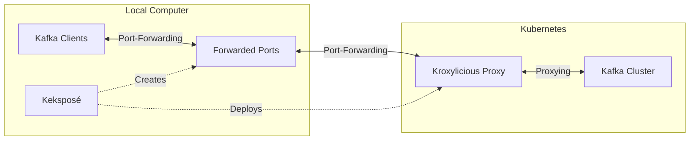

# Keksposé

_**Expose** your **Kafka** cluster outside your Minikube, Kind, or Docker Desktop clusters._

## What is Keksposé?

[Strimzi](https://strimzi.io) makes it easy to run [Apache Kafka](https://kafka.apache.org/) on Kubernetes.
But using the Kafka cluster from applications running outside of your Kubernetes cluster can be [challenging](https://strimzi.io/blog/2019/04/17/accessing-kafka-part-1/).
Strimzi tries to make it as easy as possible and supports several different ways how to _expose_ the Kafka cluster:
* Using Load Balancers
* Using Node Ports
* Using the Kubernetes Nginx Ingress controller

When running in production-grade Kubernetes environments, these usually work fine.
But when using a local Kubernetes cluster such as Minikube, Kind or Docker Desktop, these mechanisms are often not well-supported:
* The local clusters often lack proper support for load balancers
* They often run inside additional virtual machines or containers and use complex networking so that node ports do not work out of the box
* While Ingress usually works, the installation of the right Ingress controller and its configuration is often complicated 

One of the way how applications are often exposed from local clusters is port-forwarding.
But using port-forward with Apache Kafka is not so simple because of its custom discovery protocol.
Keksposé makes it possible to use port-forward with Apache Kafka with the help of [Kroxylicious](https://kroxylicious.io/). 

## How does it work?

Keksposé find a listener without TLS encryption on your Strimzi-based Apache Kafka clusters and exposes it.
It deploys a Kafka proxy based on the [Kroxylicious](https://kroxylicious.io/) project into your Kubernetes cluster and configures it to manage the advertised hosts and ports in the Kafka metadata.
It also creates a port-forward for each of the Kafka brokers in your cluster.
Your Kafka clients can then connect to the forwarded ports and through the proxy to the Kafka cluster to send and receive messages. 

Kekspose is written in Java using the [Quarkus framework](https://quarkus.io/).
That allows it to provide binaries to run Keksposé.

## How to use Keksposé?

### Installation

You can download one of the release binaries from one of the release and use it.
Alternatively, you can also checkout the project and run it from your IDE or from command line with the `mvn quarkus:dev` command.

### Configuration

Keksposé supports several parameters that can be used to configure it:

| Option                   | Description                                                                                                                                                         | Default Value |
|--------------------------|---------------------------------------------------------------------------------------------------------------------------------------------------------------------|---------------|
| `--namespace` / `-n`     | Namespace of the Kafka cluster. This is also the namespace where the Keksposé proxy will be deployed. Defaults to the namespace form your Kubernetes configuration. |               |
| `--cluster-name` / `-c`  | Name of the Kafka cluster.                                                                                                                                          | `myproject`   |
| `--listener-name`/ `-l`  | Name of the listener that should be exposed. If not set, Keksposé will try to find a suitable listener on its own.                                                  |               |
| `--starting-port` / `-p` | The starting port number. This port number will be used for the bootstrap connection and will be used as the basis to calculate the per-broker ports.               | `50000`       |
| `--kekspose-name` / `-k` | Name that will be used for the Keksposé ConfigMap and Pod.                                                                                                          | `kekspose`    |

If you are using the Keksposé binary, you can just pass the options form the command line.
When using the Quarkus Dev mode, you can pass options using the `quakrus.args` system property - e.g. `mvn quarkus:dev -Dquarkus.args="--help"`.  

## Frequently Asked Questions

### Does Keksposé support Kafka clusters with authentication?

Keksposé requires a listener without TLS encryption.
But it supports Kafka clusters with SASL based authentication such as SCRAM-SHA or OAuth. 

### What happens when I scale my Kafka cluster?

You might need to restart Keksposé after scaling up your Kafka cluster or changing the IDs of the Apache Kafka nodes.

### Does Keksposé support KRaft-based Apache Kafka clusters?

Keksposé supports Kraft-based Apache Kafka cluster.
However, it exposes the broker nodes only.

### What RBAC rights do I need to run Keksposé?

Running Keksposé requires the following RBAC rights:
* Reading the Kafka and KafkaNodePool Strimzi resources
* Creating and deleting a Pod with the Kroxylicious proxy and a ConfigMap with configuration
* Needs to be able to port-forward ports from the proxy Pod

### Does Keksposé work only with local Kubernetes clusters?

Keksposé was designed with focus on local Kubernetes environment such as Minikube, Kind, or Docker Desktop.
But it can be used with any Kubernetes cluster

## Building

You can build the native binary after installing the GraalVM and running `mvn package -Pnative`.