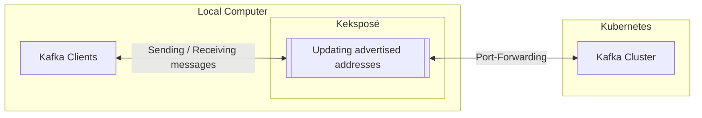

# Keksposé

_**Expose** your **Kafka** cluster outside your Minikube, Kind, or Docker Desktop Kubernetes clusters._

<!-- TODO: Do a new video of the new Keksposé version -->
<!-- [](http://www.youtube.com/watch?v=EOpWH9gfKmU "Keksposé: Expose your Kafka outside your Minikube, Kind, or Docker Desktop Kubernetes clusters") -->

## What is Keksposé?

[Strimzi](https://strimzi.io) makes it easy to run [Apache Kafka](https://kafka.apache.org/) on Kubernetes.
But using the Kafka cluster from applications running outside your Kubernetes cluster can be [challenging](https://strimzi.io/blog/2019/04/17/accessing-kafka-part-1/).
Strimzi tries to make it as easy as possible and supports several different ways how to _expose_ the Kafka cluster:
* Using Load Balancers
* Using Node Ports
* Using the Kubernetes Nginx Ingress controller

When running in production-grade Kubernetes environments, these usually work fine.
But when using a local Kubernetes cluster such as Minikube, Kind, or Docker Desktop, these mechanisms are often not well-supported:
* The local clusters often lack proper support for load balancers
* They often run inside additional virtual machines or containers and use complex networking so that node ports do not work out of the box
* While Ingress usually works, the installation of the right Ingress controller and its configuration is often complicated 

One of the ways how applications are often exposed from local clusters is using port forwarding with `kubectl port-foward`.
But using port forwarding with Apache Kafka is not so simple because of its custom discovery protocol.
You need to forward ports for each broker in the Kafka cluster.
And you need to make sure your advertised hosts and ports are correctly configured to the local address.
Keksposé makes it possible to use port forwarding with Apache Kafka by proxying the Kafka protocol and adjusting the advertised hosts and ports to the forwarded port addresses. 

## How does it work?

Keksposé finds a listener without TLS encryption on your Strimzi-based Apache Kafka clusters and exposes it.
It creates a port-forward for each of the Kafka brokers in your cluster.
But it stands in the middle between the Kafka clients and the Kafka brokers and changes the advertised hosts and ports to the local addresses of the forwarded ports.
Your Kafka clients can then connect to the forwarded ports and through Keksposé to the Kafka cluster to send and receive messages. 



Kekspose is written in Golang using the [Strimzi Go APIs](https://github.com/scholzj/strimzi-go).
That allows it to provide native binaries to make it easier to run Keksposé.

_Note: For the previous version based on the Kroxylicious proxy, see the [0.6.x release branch](https://github.com/scholzj/kekspose/tree/release-0.6.x) and use one of the 0.6.x releases._

## How to use Keksposé?

### Installation

You can download one of the release binaries from one of the releases and use it.

### Configuration

Keksposé supports several parameters that can be used to configure it:

| Option                   | Description                                                                                                                                                         | Default Value |
|--------------------------|---------------------------------------------------------------------------------------------------------------------------------------------------------------------|---------------|
| `--help` / `-h`          | Help                                                                                                                                                                |               |
| `--kubeconfig`           | Path to the kubeconfig file to use for Kubernetes API requests.                                                                                                     |               |
| `--namespace` / `-n`     | Namespace of the Kafka cluster. This is also the namespace where the Keksposé proxy will be deployed. Defaults to the namespace from your Kubernetes configuration. |               |
| `--cluster-name` / `-c`  | Name of the Kafka cluster.                                                                                                                                          | `my-cluster`  |
| `--listener-name`/ `-l`  | Name of the listener that should be exposed. If not set, Keksposé will try to find a suitable listener on its own.                                                  |               |
| `--starting-port` / `-p` | The starting port number. This port number will be used for the bootstrap connection and will be used as the basis to calculate the per-broker ports.               | `50000`       |
| `--verbose` / `-v`       | Enables verbose logging (can be repeated: -v, -vv, -vvv).                                                                                                           |               |

If you are using the Keksposé binary, you can pass the options from the command line.

### Debugging Kafka clients

In the verbose mode (`-v` or `--verbose`), Kekspsé will log high level information about the request and repsonses it is forwarding.
For example:
```
-> Received request: node=2000; size=52; apiKey=1; version=17; correlationID=694; clientId=console-consumer; bodySize=26 bytes
<- Received response: node=2000; size=17; apiKey=1; version=17; correlationID=694; clientId=console-consumer; bodySize=13 bytes
```

You can further increase the verbosity by using an extra verbose mode `-vv`.
This will in addition dump the content of the request and response bodies.
However, at this point, only the ApiVersions, Metadata, and FIndCoordinator requests and responses are supported 🫣. 

## Frequently Asked Questions

### Does Keksposé support Kafka clusters with authentication?

Keksposé requires a listener without TLS encryption.
But it supports Kafka clusters with SASL-based authentication, such as SCRAM-SHA or OAuth. 

### What happens when I scale my Kafka cluster?

You need to restart Keksposé after scaling up your Kafka cluster or changing the IDs of the Apache Kafka nodes.

### Does Keksposé support KRaft-based Apache Kafka clusters?

Keksposé supports a Kraft-based Apache Kafka cluster.
However, it currently exposes the broker nodes only.
If you have any need / use-cases for exposing the controller nodes as well, feel free to open an issue.

### What access rights do I need to run Keksposé?

Running Keksposé requires the following access rights to your Kubernetes cluster:
* Reading the Kafka and KafkaNodePool Strimzi resources from the selected namespace
* Needs to be able to forward ports from the proxy Pod

The recent Keksposé versions do not need the access rights to create or delete Pods in the selected namespace.

### Does Keksposé work only with local Kubernetes clusters?

Keksposé was designed with a focus on local Kubernetes environments such as Minikube, Kind, or Docker Desktop.
But it can be used with any Kubernetes cluster regardless of how and where you run it.

### Can the same Kafka cluster be exposed to multiple users in parallel?

Any user who has access to the Kubernetes cluster and the necessary rights can expose it.
The same cluster can be exposed in parallel by multiple users. 

### What does the name Keksposé mean?

It is a combination of several words: `Kafka`, `Expose` ... and `Keks` (biscuit) because everyone likes them 😉.
